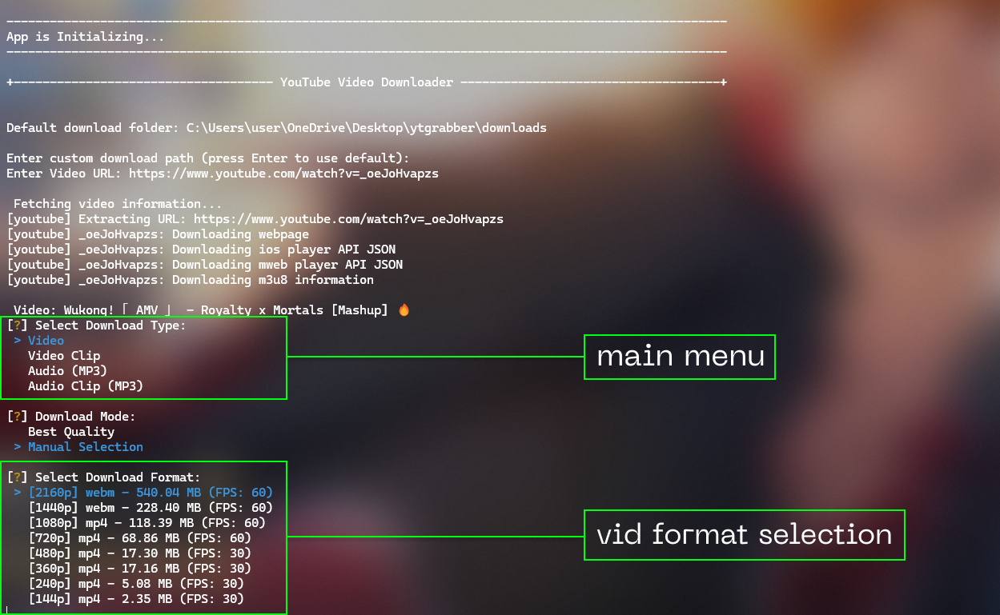
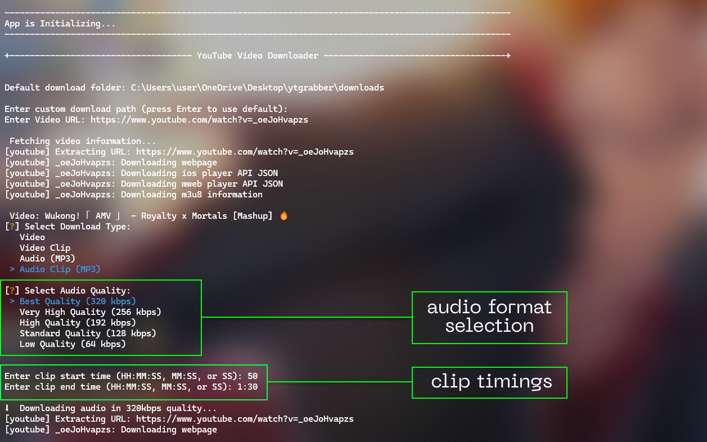

<div align="center">


<br>

🎥 Lightweight command-line tool that download YouTube videos, audios and audio/video clips, supporting almost every platform.

[](https://www.python.org/)
[](https://ffmpeg.org/)
[](LICENSE)


</div>

## 🔥 Features

- Download videos/clips in available quality formats (up to 4K)
- Download audio in MP3 format 
- ✨ NEW: Smart clipping - Download only what you watch, saving bandwidth and storage
- Interactive format selection
- Simple command-line interface
- Customizable download path
- Straightforward Installation
- Cross-platform compatibility (Windows, Linux, macOS, Android)

## 🛠️ Requirements

- FFmpeg
  - Windows: FFmpeg requires manual installation. You can either:
    - Download the pre-configured Build [here](https://github.com/BtbN/FFmpeg-Builds/releases/download/latest/ffmpeg-master-latest-win64-gpl.zip)
    - Or download from the [official site](https://ffmpeg.org/download.html)
  - After downloading, add FFmpeg to your system's PATH environment variable

  - Linux/MacOS: The `install_command.py` script will automatically install FFmpeg if it's not installed or not found in PATH

## 📥 Installation

#### 1. Clone the repository
```bash
git clone https://github.com/ad1tyac0des/ytgrabber
cd ytgrabber
```

#### 2. Setup YTGrabber Command (Run Once):

##### *Windows PowerShell*:
```powershell
python install_command.py
```

<details>
<summary>💡 Note for Windows Users</summary>

- The script will request admin access once
- It only adds YTGrabber commands to your system PATH
- No other modifications are made to your system
- Your privacy and security are our top priority
- Being open-source, all code changes are transparent and verifiable

</details>

##### *Linux/MacOS*:
```bash
python3 install_command.py
```

#### 3. Now, Run the application using `ytgrabber` or `ytgrab` command in your terminal

### *Android* 🤖:

For Android Installtion instructions, check out our [Android Installation Guide](./docs/android-installation.md) 📲

## 🔄 Uninstallation

Need to uninstall? Check out our [Uninstallation Guide](./docs/uninstallation.md) for detailed instructions.

## 🚀 General Usage

1. Run the application using `ytgrabber` or `ytgrab` command in terminal
2. Enter the desired download path or press Enter to use the default
3. Enter the YouTube video URL
4. Select the download type (video/audio/video clip/audio clip)
5. Select the desired format and quality
6. Wait for download to complete

## 🎬 Downloading Audio/Video Clips

1. Enter the YouTube video URL
2. Select the download type (video clip/audio clip)
3. Enter the start and end times for the clip in `HH:MM:SS` OR `MM:SS` OR `SS` format (e.g. `1:30` for 1 minute and 30 seconds, `45` for 45 seconds, `2:01:40` for 2 hours, 1 minute and 40 seconds, etc.)
4. Select the desired quality
5. Wait for download to complete

## 📸 Screenshots

<div align="center">





</div>

## 🤝 Contributing

Contributions are welcome! Feel free to:

- Report bugs
- Suggest new features
- Submit pull requests

## 📄 License 
[](LICENSE)
<br>

This project is licensed under the Apache License 2.0 - see the [LICENSE](LICENSE) file for details.